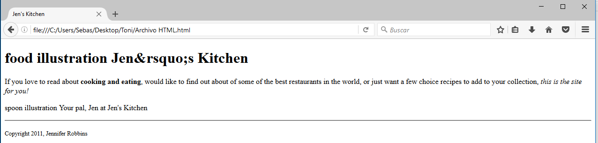
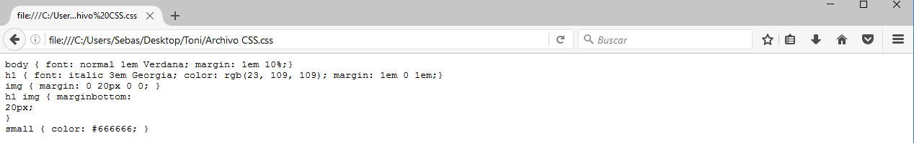
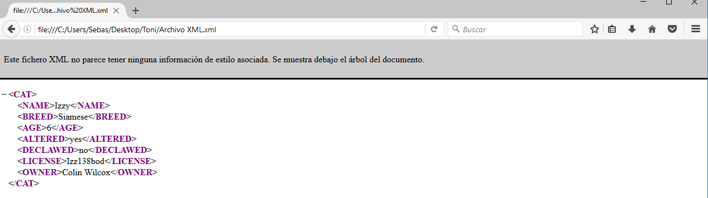
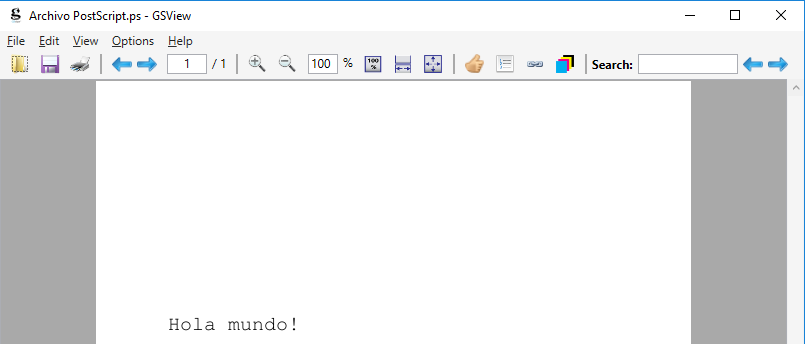
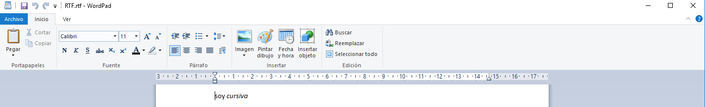

# ASIR
#### Tarea 1 LGMSGI
Creación de un repositorio en [Github](www.github.com) e incorporar a él todos los archivos conteniendo los lenguajes de marcas especificados.
Se han creado los archivos en texto plano, modificando posteriormente la extensión.
Los lenguajes a utilizados para la tarea son:
* _HTML_
* _CSS_
* _XML_
* _PS_
* _RFT_

#### Lenguaje _HTML_

Visualización del archivo creado:

#### Lenguaje _CSS_

Visualización del archivo creado:

#### Lenguaje _XML_

Visualización del archivo creado:

Código XML copiado de la página: https://support.office.com/es-es/article/XML-para-principiantes-A87D234D-4C2E-4409-9CBC-45E4EB857D44

#### Lenguaje _PS_

Visualización del archivo creado:

#### Lenguaje _RTF_

Visualización del archivo creado:

#### NOTAS:

Para abrir los archivos _HTML_, _CSS_ y _XML_ se ha utilizado el navegador **Mozilla Firefox**.  
Las capturas de pantalla son propias y creadas con el programa **Paint**.  
Para abrir el archivo PostScript se ha utilizado el visor **[GSVIEW](www.gsview.com)**.  
Para abrir el archivo RTF se ha utilizado el programa **Wordpad**.  
En el repositorio se han incluído todas las capturas de pantalla realizadas para la tarea.  

